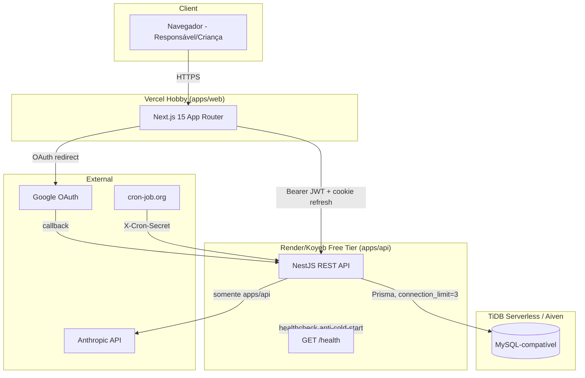
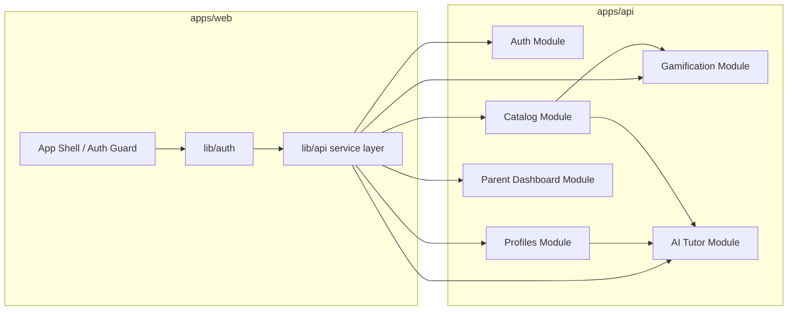
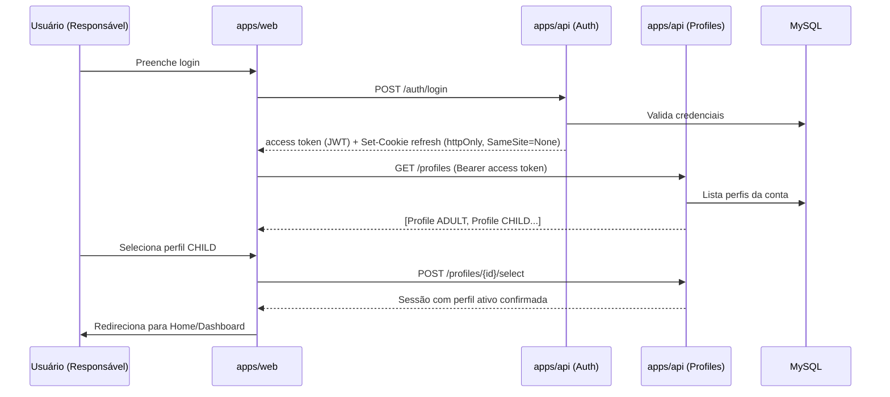
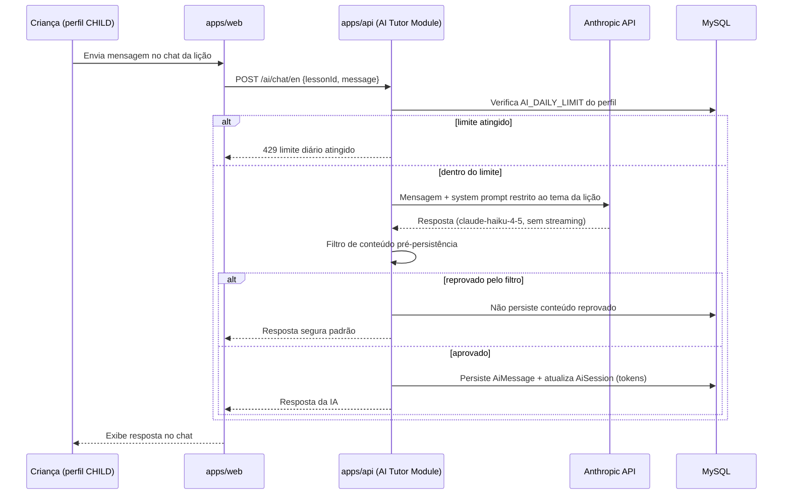
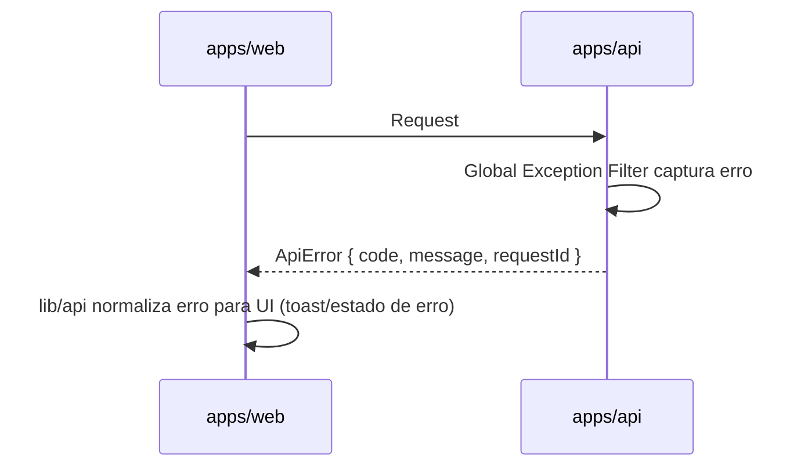

# Inglês para Pequenos (Karina Martins) Fullstack Architecture Document

## Introduction

Este documento descreve a arquitetura fullstack completa da plataforma Inglês para Pequenos (Karina Martins), cobrindo backend, frontend e a integração entre eles. Serve como fonte única de verdade para o desenvolvimento orientado por agentes de IA, garantindo consistência em toda a stack.

A stack, o ambiente de deploy e a maior parte das regras de domínio já estavam fixadas de forma não-negociável no `CLAUDE.md` do projeto antes deste documento existir; esta arquitetura formaliza, detalha e preenche as lacunas técnicas que o PRD (`docs/prd.md`) deixou em aberto para os 5 epics, sem reabrir decisões já tomadas.

### Starter Template or Existing Project

N/A parcial — greenfield, mas **não greenfield de arquitetura**: o scaffold do monorepo (Turborepo + pnpm, `apps/web`, `apps/api`, `packages/database|shared|ui`) já foi criado e publicado na Fase 0 (commit `760221b`). Esta arquitetura trabalha sobre essa fundação existente, não parte do zero.

### Change Log

| Date | Version | Description | Author |
|---|---|---|---|
| 2026-07-29 | 0.1 | Criação inicial da arquitetura fullstack | Aria (Architect) |

## High Level Architecture

### Technical Summary

A plataforma é um monorepo Turborepo/pnpm com dois serviços deployados de forma independente: `apps/web` (Next.js 15 App Router, Vercel Hobby) e `apps/api` (NestJS REST, Render ou Koyeb free tier), comunicando-se via HTTPS/JSON com autenticação JWT cross-domain (access token em header + refresh token em cookie `SameSite=None; Secure`). O banco é MySQL-compatível (TiDB Serverless ou Aiven) acessado via Prisma, com todo estado de aplicação persistido no banco (a API não guarda estado em memória entre requests, pois pode dormir no free tier). A única integração externa de peso é a Anthropic API, isolada exclusivamente em `apps/api`. Essa arquitetura atende às metas do PRD ao permitir demo gratuita e funcional agora, com migração direta para uma VPS Hostinger no futuro sem redesenho estrutural.

### Platform and Infrastructure Choice

Não há decisão a tomar aqui — a plataforma já está fixada no `CLAUDE.md` (ambiente de teste/demo, gratuito):

**Platform:** Vercel Hobby (web) + Render ou Koyeb free tier (api) + TiDB Serverless ou Aiven (banco)
**Key Services:** Vercel Edge/CDN (front), Render/Koyeb container runtime (api), TiDB/Aiven (MySQL-compatível serverless), cron-job.org (cron externo do streak)
**Deployment Host and Regions:** Região padrão de cada provedor free tier (não configurável em plano gratuito); latência cross-region é aceitável para uma demo

### Repository Structure

**Structure:** Monorepo
**Monorepo Tool:** Turborepo + pnpm workspaces (já implementado)
**Package Organization:** `apps/web`, `apps/api` como aplicações deployáveis; `packages/database` (Prisma + client gerado), `packages/shared` (tipos/DTOs/schemas zod), `packages/ui` (design system, tokens de tema) como bibliotecas internas consumidas por ambos os apps

### High Level Architecture Diagram



### Architectural Patterns

- **Jamstack-like com API dedicada:** Next.js no front consumindo uma API REST separada (não Server Actions diretas ao banco) — _Rationale:_ mantém a regra de domínio de que somente `apps/api` acessa banco e Anthropic, e permite o front ficar 100% no Vercel sem acoplar a lógica de negócio
- **Service Layer isolado para Auth (`lib/auth`):** toda lógica de token/refresh do front centralizada em um único módulo — _Rationale:_ regra explícita do CLAUDE.md para permitir trocar de cookie cross-domain para same-site na migração Hostinger tocando um único arquivo
- **Ledger Pattern para XP:** XP nunca é um campo mutável, sempre soma de eventos (`XpEvent`) — _Rationale:_ auditabilidade e regra de domínio não-negociável
- **Repository Pattern implícito via Prisma:** módulos NestJS acessam dados através de services dedicados por domínio (não Prisma direto em controllers) — _Rationale:_ testabilidade e futura migração de banco
- **BFF-lite (Backend for Frontend) parcial:** endpoints de "jornada/ranking" agregam dados de múltiplos domínios (XP, streak, badges) num único payload — _Rationale:_ reduz round-trips do front sem introduzir GraphQL, que seria over-engineering para o escopo

## Tech Stack

Esta tabela é a fonte única de verdade. A maior parte já está travada pelo `CLAUDE.md`; os itens marcados com `*` são decisões novas desta arquitetura (áreas que o CLAUDE.md não especificava).

| Category | Technology | Version | Purpose | Rationale |
|---|---|---|---|---|
| Frontend Language | TypeScript | 5.7.2 | Tipagem em todo o front | Já fixado (Fase 0) |
| Frontend Framework | Next.js | 15.1.0 | App Router, SSR/SSG | Já fixado no CLAUDE.md |
| UI Component Library | shadcn/ui + Tailwind | latest compatível | Componentes acessíveis, tema claro/escuro | Já fixado |
| State Management | React Context + Zustand* | zustand ^4 | Estado de perfil ativo, toasts de XP, tema | *Novo: escopo pequeno não justifica Redux; Zustand é leve o suficiente para o free tier e evita prop-drilling do perfil ativo |
| Backend Language | TypeScript | 5.7.2 | Tipagem em toda a API | Já fixado |
| Backend Framework | NestJS | ^10 | REST API modular | Já fixado |
| API Style | REST | OpenAPI 3.0 | Contrato entre web e api | Já fixado (regra de domínio: API isolada) |
| Database | MySQL-compatível (TiDB Serverless/Aiven) | MySQL 8 dialect | Persistência | Já fixado |
| ORM | Prisma | 6.1.0 | Acesso a dados tipado | Já fixado (Fase 0) |
| Cache | Nenhum* | — | — | *Decisão: sem cache dedicado (Redis etc.) no MVP — 512MB RAM e free tier não comportam mais um serviço; cache HTTP simples via headers onde aplicável |
| File Storage | Nenhum (assets do design system em código)* | — | Thumbnails são artes do design system, não upload de usuário | *Sem necessidade de storage de blobs no MVP |
| Authentication | JWT (access) + cookie httpOnly (refresh) + Google OAuth | jsonwebtoken / Passport | Auth cross-domain | Já fixado |
| Frontend Testing | Vitest + React Testing Library* | latest | Testes unitários de componentes/hooks | *Escolhido por ser mais rápido que Jest em ESM/Vite e integrar bem com Next.js |
| Backend Testing | Jest + Supertest* | Jest ^29 (padrão NestJS) | Unit + Integration (endpoints) | *Jest é o padrão do NestJS CLI; Supertest para testes de integração HTTP |
| E2E Testing | N/A | — | Fora de escopo do MVP | Fixado no PRD (NFR11) |
| Build Tool | Turbo | 2.3.3 | Orquestração do monorepo | Já fixado |
| Bundler | Next.js interno (Turbopack/Webpack) | — | Build do front | Padrão do framework |
| IaC Tool | Nenhum* | — | Configuração manual nos dashboards Vercel/Render-Koyeb | *Free tier + demo não justificam Terraform/Pulumi; migração futura para VPS pode reavaliar |
| CI/CD | GitHub Actions* | — | Lint/typecheck/build em PRs | *Não especificado no CLAUDE.md; GitHub Actions é gratuito para repositório privado com uso moderado e já integrado ao fluxo do @devops |
| Monitoring | Vercel Analytics (free) + logs nativos do Render/Koyeb* | — | Observabilidade mínima | *Sem orçamento para APM dedicado (Sentry/Datadog) no ambiente de demo; reavaliar na migração para produção |
| Logging | NestJS Logger nativo (JSON estruturado)* | — | Logs da API | *Zero dependência extra, adequado ao limite de 512MB |
| CSS Framework | Tailwind CSS | latest compatível com Next 15 | Estilização | Já fixado |
| Validation | zod | latest | Validação de entrada compartilhada | Já fixado (`packages/shared`) |

## Data Models

### User

**Purpose:** Representa a conta de login do responsável (adulto) — a "conta familiar" à qual os perfis (incluindo o próprio adulto) pertencem.

**Key Attributes:**
- id: string (cuid) - identificador único
- email: string - login/contato
- passwordHash: string | null - null quando login é 100% via Google
- googleId: string | null - vínculo OAuth
- createdAt: DateTime

```typescript
export interface User {
  id: string;
  email: string;
  passwordHash: string | null;
  googleId: string | null;
  createdAt: string;
}
```

**Relationships:**
- Um `User` possui muitos `Profile` (1:N)

### Profile

**Purpose:** Representa um perfil de uso dentro da conta — pode ser o próprio responsável (ADULT) ou uma criança (CHILD). Unidade sobre a qual XP, streak, badges e sessões de IA são calculados.

**Key Attributes:**
- id: string
- userId: string
- type: "ADULT" | "CHILD"
- nickname: string
- ageRange: string | null - somente para CHILD (ex: "4-6", "7-9")
- currentStreak: int
- longestStreak: int
- lastActiveDate: Date | null

```typescript
export type ProfileType = "ADULT" | "CHILD";

export interface Profile {
  id: string;
  userId: string;
  type: ProfileType;
  nickname: string;
  ageRange: string | null;
  currentStreak: number;
  longestStreak: number;
  lastActiveDate: string | null;
}
```

**Relationships:**
- Pertence a um `User`
- Possui muitos `XpEvent`, `LessonProgress`, `ProfileBadge`, `AiSession`

### Show / Track / Lesson

**Purpose:** Estrutura do catálogo de conteúdo educacional (show → trilha → lição), com conteúdo 100% original.

```typescript
export interface Show {
  id: string;
  title: string;
  synopsis: string; // conteúdo original, nunca copiado de terceiros
  thumbnailKey: string; // referência a asset do design system, não upload
  createdAt: string;
}

export interface Track {
  id: string;
  showId: string;
  title: string;
  order: number;
}

export interface Lesson {
  id: string;
  trackId: string;
  title: string;
  order: number;
  contentBody: string; // conteúdo original
  createdAt: string;
}
```

**Relationships:** `Show` 1:N `Track` 1:N `Lesson`

### LessonProgress

**Purpose:** Marca quais lições um perfil já concluiu (necessário para FR/Story 2.3 — "lições concluídas ficam marcadas").

```typescript
export interface LessonProgress {
  id: string;
  profileId: string;
  lessonId: string;
  completedAt: string;
}
```

**Relationships:** N:1 com `Profile` e `Lesson` (chave única composta `profileId+lessonId`)

### XpEvent

**Purpose:** Ledger de eventos de XP — única fonte de verdade para o XP total de um perfil (nunca um campo mutável).

```typescript
export type XpEventSource = "LESSON_COMPLETED" | "STREAK_BONUS" | "BADGE_AWARDED";

export interface XpEvent {
  id: string;
  profileId: string;
  amount: number;
  source: XpEventSource;
  createdAt: string;
}
```

**Relationships:** N:1 com `Profile`. XP total = `SUM(amount) WHERE profileId = X`

### Badge / ProfileBadge

**Purpose:** Conquistas visuais concedidas a um perfil.

```typescript
export interface Badge {
  id: string;
  code: string;
  title: string;
  description: string;
  iconKey: string;
}

export interface ProfileBadge {
  id: string;
  profileId: string;
  badgeId: string;
  awardedAt: string;
}
```

**Relationships:** N:N entre `Profile` e `Badge` via `ProfileBadge`

### AiSession / AiMessage

**Purpose:** Auditoria de interações de IA (tokens, idioma) e transcrição completa visível ao responsável.

```typescript
export type AiLanguage = "EN" | "PT";

export interface AiSession {
  id: string;
  profileId: string;
  lessonId: string | null; // null para o assistente PT de dúvidas gerais
  language: AiLanguage;
  promptTokens: number;
  completionTokens: number;
  createdAt: string;
}

export interface AiMessage {
  id: string;
  sessionId: string;
  role: "user" | "assistant";
  content: string;
  flaggedByFilter: boolean;
  createdAt: string;
}
```

**Relationships:** `AiSession` 1:N `AiMessage`; N:1 com `Profile`

## API Specification

### REST API Specification

```yaml
openapi: 3.0.0
info:
  title: Inglês para Pequenos API
  version: 0.1.0
  description: API REST da plataforma Karina Martins (apps/api)
servers:
  - url: https://{api-host}
    description: Render ou Koyeb free tier (env-dependent)

paths:
  /health:
    get:
      summary: Healthcheck sem tocar o banco
      responses:
        "200": { description: OK }

  /auth/register:
    post:
      summary: Cria conta (User) + primeiro perfil ADULT
      security: []
  /auth/login:
    post:
      summary: Login com email/senha, retorna access token + refresh cookie
      security: []
  /auth/refresh:
    post:
      summary: Renova access token a partir do refresh cookie
      security: []
  /auth/logout:
    post:
      summary: Invalida refresh cookie
  /auth/google:
    get:
      summary: Inicia fluxo OAuth Google
      security: []
  /auth/google/callback:
    get:
      summary: Callback OAuth, cria/associa User
      security: []

  /profiles:
    get:
      summary: Lista perfis da conta autenticada
    post:
      summary: Cria perfil CHILD (apelido + faixa etária apenas)
  /profiles/{id}/select:
    post:
      summary: Define perfil ativo da sessão

  /catalog/shows:
    get:
      summary: Lista shows do catálogo
      security: []
  /catalog/shows/{id}/tracks:
    get:
      summary: Lista trilhas de um show
  /catalog/tracks/{id}/lessons:
    get:
      summary: Lista lições de uma trilha, com progresso do perfil ativo
  /lessons/{id}:
    get:
      summary: Detalhe de uma lição
  /lessons/{id}/complete:
    post:
      summary: Marca lição como concluída e gera XpEvent (LESSON_COMPLETED)

  /gamification/xp:
    get:
      summary: XP total do perfil ativo (soma de XpEvent)
  /gamification/badges:
    get:
      summary: Badges do perfil ativo
  /gamification/ranking:
    get:
      summary: Ranking por XP total entre perfis (sem dados sensíveis)

  /internal/cron/streak:
    post:
      summary: Job diário de atualização de streak
      security:
        - cronSecret: []

  /ai/chat/en:
    post:
      summary: Chat de IA em inglês restrito ao universo da lição ativa
  /ai/chat/pt:
    post:
      summary: Assistente de IA em português para dúvidas

  /parent/profiles/{id}/journey:
    get:
      summary: Jornada/progresso consolidado de um perfil CHILD
  /parent/profiles/{id}/transcripts:
    get:
      summary: Transcrições de AiSession de um perfil CHILD

components:
  securitySchemes:
    bearerAuth:
      type: http
      scheme: bearer
      bearerFormat: JWT
    cronSecret:
      type: apiKey
      in: header
      name: X-Cron-Secret
security:
  - bearerAuth: []
```

## Components

**Auth Module (apps/api)**
- **Responsibility:** Registro, login, refresh, Google OAuth, emissão/validação de JWT
- **Key Interfaces:** `/auth/*`
- **Dependencies:** `packages/database` (User/Profile), `packages/shared` (DTOs zod)
- **Technology Stack:** NestJS + Passport + jsonwebtoken

**Profiles Module (apps/api)**
- **Responsibility:** CRUD de perfis, seleção de perfil ativo, guarda de permissões CHILD vs ADULT
- **Key Interfaces:** `/profiles/*`
- **Dependencies:** Auth Module (guard de sessão)
- **Technology Stack:** NestJS Guards/Decorators

**Catalog Module (apps/api)**
- **Responsibility:** Shows, trilhas, lições, progresso
- **Key Interfaces:** `/catalog/*`, `/lessons/*`
- **Dependencies:** `packages/database`
- **Technology Stack:** NestJS + Prisma

**Gamification Module (apps/api)**
- **Responsibility:** Ledger de XP, streak (job cron), badges, ranking
- **Key Interfaces:** `/gamification/*`, `/internal/cron/streak`
- **Dependencies:** Catalog Module (evento de conclusão de lição dispara XpEvent)
- **Technology Stack:** NestJS + Prisma

**AI Tutor Module (apps/api)**
- **Responsibility:** Chamadas à Anthropic API, filtro de conteúdo, limite diário, registro em AiSession/AiMessage
- **Key Interfaces:** `/ai/chat/en`, `/ai/chat/pt`
- **Dependencies:** Profiles Module (perfil ativo), Catalog Module (contexto da lição)
- **Technology Stack:** NestJS + Anthropic SDK (isolado, `ANTHROPIC_API_KEY` só aqui)

**Parent Dashboard Module (apps/api)**
- **Responsibility:** Agregação de jornada/progresso e exposição de transcrições para o responsável
- **Key Interfaces:** `/parent/*`
- **Dependencies:** Gamification Module, AI Tutor Module

**Frontend App Shell (apps/web)**
- **Responsibility:** Roteamento App Router, layout com tema claro/escuro, guarda de rotas protegidas
- **Key Interfaces:** Consome todos os módulos da API via service layer (`lib/api`)
- **Dependencies:** `packages/ui`, `packages/shared`
- **Technology Stack:** Next.js 15 + Tailwind + shadcn/ui + Zustand



## External APIs

### Anthropic API

- **Purpose:** Motor de IA para o tutor em inglês (`claude-haiku-4-5`) e assistente de dúvidas em português (`claude-sonnet-4-6`)
- **Documentation:** https://docs.anthropic.com
- **Base URL(s):** `https://api.anthropic.com`
- **Authentication:** API key (`ANTHROPIC_API_KEY`), somente em `apps/api`
- **Rate Limits:** Conforme plano contratado; mitigado no produto por `AI_DAILY_LIMIT` por perfil

**Key Endpoints Used:**
- `POST /v1/messages` - geração de resposta de chat (sem streaming, `AI_STREAMING=false`)

**Integration Notes:** Nunca expor a chave ao front; toda chamada passa pelo AI Tutor Module, que aplica filtro de conteúdo antes de persistir e checa `AI_DAILY_LIMIT` antes de chamar a API (evita custo de chamada que seria descartada).

### Google OAuth

- **Purpose:** Login social para contas ADULT
- **Documentation:** https://developers.google.com/identity/protocols/oauth2
- **Base URL(s):** `https://accounts.google.com/o/oauth2/v2/auth`
- **Authentication:** OAuth 2.0 (`GOOGLE_CLIENT_ID`/`GOOGLE_CLIENT_SECRET`)
- **Rate Limits:** N/A para o volume de uma demo

**Key Endpoints Used:**
- `GET /auth/google` (redirect) / `GET /auth/google/callback`

**Integration Notes:** Callback deve criar ou associar um `User` existente pelo `googleId`/email.

### cron-job.org (ambiente de teste)

- **Purpose:** Disparar `POST /internal/cron/streak` diariamente
- **Documentation:** https://cron-job.org/en/
- **Base URL(s):** N/A (serviço externo chama a API, não o contrário)
- **Authentication:** Header `X-Cron-Secret` configurado no serviço externo
- **Rate Limits:** N/A (1 chamada/dia)

**Integration Notes:** Na migração para produção (hPanel/Hostinger), o mesmo endpoint é reaproveitado — só troca quem dispara o cron.

## Core Workflows

### Login + Seleção de Perfil



### Chat de IA em inglês (lição ativa)



## Database Schema

```sql
-- Dialeto MySQL 8 / MariaDB / TiDB compatível (sem fulltext avançado, sem stored procedures)

CREATE TABLE User (
  id            VARCHAR(191) PRIMARY KEY,
  email         VARCHAR(191) NOT NULL UNIQUE,
  passwordHash  VARCHAR(191) NULL,
  googleId      VARCHAR(191) NULL UNIQUE,
  createdAt     DATETIME(3) NOT NULL DEFAULT CURRENT_TIMESTAMP(3)
);

CREATE TABLE Profile (
  id             VARCHAR(191) PRIMARY KEY,
  userId      VARCHAR(191) NOT NULL,
  type           ENUM('ADULT','CHILD') NOT NULL,
  nickname       VARCHAR(60) NOT NULL,
  ageRange       VARCHAR(20) NULL,
  currentStreak  INT NOT NULL DEFAULT 0,
  longestStreak  INT NOT NULL DEFAULT 0,
  lastActiveDate DATE NULL,
  createdAt      DATETIME(3) NOT NULL DEFAULT CURRENT_TIMESTAMP(3),
  FOREIGN KEY (userId) REFERENCES User(id) ON DELETE CASCADE,
  INDEX idx_profile_account (userId)
);

CREATE TABLE Show (
  id           VARCHAR(191) PRIMARY KEY,
  title        VARCHAR(191) NOT NULL,
  synopsis     TEXT NOT NULL,
  thumbnailKey VARCHAR(191) NOT NULL,
  createdAt    DATETIME(3) NOT NULL DEFAULT CURRENT_TIMESTAMP(3)
);

CREATE TABLE Track (
  id      VARCHAR(191) PRIMARY KEY,
  showId  VARCHAR(191) NOT NULL,
  title   VARCHAR(191) NOT NULL,
  `order` INT NOT NULL,
  FOREIGN KEY (showId) REFERENCES Show(id) ON DELETE CASCADE,
  INDEX idx_track_show (showId)
);

CREATE TABLE Lesson (
  id          VARCHAR(191) PRIMARY KEY,
  trackId     VARCHAR(191) NOT NULL,
  title       VARCHAR(191) NOT NULL,
  `order`     INT NOT NULL,
  contentBody TEXT NOT NULL,
  createdAt   DATETIME(3) NOT NULL DEFAULT CURRENT_TIMESTAMP(3),
  FOREIGN KEY (trackId) REFERENCES Track(id) ON DELETE CASCADE,
  INDEX idx_lesson_track (trackId)
);

CREATE TABLE LessonProgress (
  id          VARCHAR(191) PRIMARY KEY,
  profileId   VARCHAR(191) NOT NULL,
  lessonId    VARCHAR(191) NOT NULL,
  completedAt DATETIME(3) NOT NULL DEFAULT CURRENT_TIMESTAMP(3),
  UNIQUE KEY uq_profile_lesson (profileId, lessonId),
  FOREIGN KEY (profileId) REFERENCES Profile(id) ON DELETE CASCADE,
  FOREIGN KEY (lessonId) REFERENCES Lesson(id) ON DELETE CASCADE
);

CREATE TABLE XpEvent (
  id        VARCHAR(191) PRIMARY KEY,
  profileId VARCHAR(191) NOT NULL,
  amount    INT NOT NULL,
  source    ENUM('LESSON_COMPLETED','STREAK_BONUS','BADGE_AWARDED') NOT NULL,
  createdAt DATETIME(3) NOT NULL DEFAULT CURRENT_TIMESTAMP(3),
  FOREIGN KEY (profileId) REFERENCES Profile(id) ON DELETE CASCADE,
  INDEX idx_xpevent_profile (profileId)
);

CREATE TABLE Badge (
  id          VARCHAR(191) PRIMARY KEY,
  code        VARCHAR(60) NOT NULL UNIQUE,
  title       VARCHAR(191) NOT NULL,
  description VARCHAR(255) NOT NULL,
  iconKey     VARCHAR(191) NOT NULL
);

CREATE TABLE ProfileBadge (
  id         VARCHAR(191) PRIMARY KEY,
  profileId  VARCHAR(191) NOT NULL,
  badgeId    VARCHAR(191) NOT NULL,
  awardedAt  DATETIME(3) NOT NULL DEFAULT CURRENT_TIMESTAMP(3),
  UNIQUE KEY uq_profile_badge (profileId, badgeId),
  FOREIGN KEY (profileId) REFERENCES Profile(id) ON DELETE CASCADE,
  FOREIGN KEY (badgeId) REFERENCES Badge(id) ON DELETE CASCADE
);

CREATE TABLE AiSession (
  id              VARCHAR(191) PRIMARY KEY,
  profileId       VARCHAR(191) NOT NULL,
  lessonId        VARCHAR(191) NULL,
  language        ENUM('EN','PT') NOT NULL,
  promptTokens    INT NOT NULL DEFAULT 0,
  completionTokens INT NOT NULL DEFAULT 0,
  createdAt       DATETIME(3) NOT NULL DEFAULT CURRENT_TIMESTAMP(3),
  FOREIGN KEY (profileId) REFERENCES Profile(id) ON DELETE CASCADE,
  FOREIGN KEY (lessonId) REFERENCES Lesson(id) ON DELETE SET NULL,
  INDEX idx_aisession_profile (profileId)
);

CREATE TABLE AiMessage (
  id              VARCHAR(191) PRIMARY KEY,
  sessionId       VARCHAR(191) NOT NULL,
  role            ENUM('user','assistant') NOT NULL,
  content         TEXT NOT NULL,
  flaggedByFilter BOOLEAN NOT NULL DEFAULT FALSE,
  createdAt       DATETIME(3) NOT NULL DEFAULT CURRENT_TIMESTAMP(3),
  FOREIGN KEY (sessionId) REFERENCES AiSession(id) ON DELETE CASCADE,
  INDEX idx_aimessage_session (sessionId)
);
```

## Frontend Architecture

### Component Organization

```text
apps/web/src/
├── app/                       # Next.js App Router
│   ├── (auth)/login/
│   ├── (auth)/register/
│   ├── (app)/select-profile/
│   ├── (app)/home/
│   ├── (app)/catalog/[showId]/
│   ├── (app)/lesson/[lessonId]/
│   ├── (parent)/dashboard/
│   └── layout.tsx
├── components/
│   ├── ui/                    # shadcn/ui + tokens de packages/ui
│   ├── gamification/          # XpBar, StreakCounter, BadgeGrid
│   └── chat/                  # ChatWindow (EN/PT)
├── lib/
│   ├── auth/                  # Toda lógica de token/refresh isolada aqui
│   └── api/                   # Service layer (fetch client)
├── stores/                    # Zustand: perfil ativo, tema, toasts de XP
└── hooks/
```

### Component Template

```typescript
// components/gamification/XpBar.tsx
interface XpBarProps {
  currentXp: number;
  className?: string;
}

export function XpBar({ currentXp, className }: XpBarProps) {
  // Componente puramente apresentacional — XP vem sempre do endpoint /gamification/xp
  return <div className={className}>{/* ... */}</div>;
}
```

### State Structure

```typescript
// stores/useProfileStore.ts
interface ProfileStoreState {
  activeProfile: Profile | null;
  setActiveProfile: (profile: Profile) => void;
  clearActiveProfile: () => void;
}
```

### State Management Patterns

- Estado de servidor (catálogo, XP, badges) via fetch direto no Server Component / route handler — sem cache de estado global duplicado
- Estado de cliente (perfil ativo selecionado, tema, toasts de XP) via Zustand, mínimo e local ao app shell
- Nenhuma mutação direta de estado — sempre via actions do store

### Route Organization

```text
/login
/register
/select-profile
/home
/catalog
/catalog/[showId]
/lesson/[lessonId]
/dashboard              (área do responsável)
/dashboard/transcripts/[profileId]
```

### Protected Route Pattern

```typescript
// app/(app)/layout.tsx
export default async function AppLayout({ children }: { children: React.ReactNode }) {
  const session = await getSessionFromCookie(); // lib/auth
  if (!session) redirect("/login");
  return <>{children}</>;
}
```

### API Client Setup

```typescript
// lib/api/client.ts
export async function apiFetch<T>(path: string, options: RequestInit = {}): Promise<T> {
  const accessToken = await getAccessToken(); // lib/auth, cuida de refresh automático
  const res = await fetch(`${process.env.NEXT_PUBLIC_API_URL}${path}`, {
    ...options,
    headers: { ...options.headers, Authorization: `Bearer ${accessToken}` },
    credentials: "include",
  });
  if (!res.ok) throw await toApiError(res);
  return res.json();
}
```

### Service Example

```typescript
// lib/api/gamification.ts
export function getXpTotal() {
  return apiFetch<{ total: number }>("/gamification/xp");
}
```

## Backend Architecture

### Service Architecture — Traditional Server (NestJS)

```text
apps/api/src/
├── modules/
│   ├── auth/
│   ├── profiles/
│   ├── catalog/
│   ├── gamification/
│   ├── ai-tutor/
│   └── parent-dashboard/
├── common/
│   ├── guards/          # JwtAuthGuard, ProfileTypeGuard, CronSecretGuard
│   ├── filters/         # Global exception filter (ApiError)
│   └── pipes/           # ZodValidationPipe
└── main.ts
```

### Controller Template

```typescript
// modules/catalog/catalog.controller.ts
@Controller("catalog")
export class CatalogController {
  constructor(private readonly catalogService: CatalogService) {}

  @Get("shows")
  listShows() {
    return this.catalogService.listShows();
  }
}
```

### Database Architecture

Schema definitivo já apresentado na seção **Database Schema** acima. Acesso via Prisma Client gerado em `packages/database`, consumido pelos services de cada módulo (nunca diretamente pelos controllers).

### Data Access Layer

```typescript
// modules/gamification/xp.repository.ts
@Injectable()
export class XpRepository {
  constructor(private readonly prisma: PrismaService) {}

  async getTotalXp(profileId: string): Promise<number> {
    const result = await this.prisma.xpEvent.aggregate({
      where: { profileId },
      _sum: { amount: true },
    });
    return result._sum.amount ?? 0;
  }
}
```

### Auth Flow

Ver diagrama de sequência em **Core Workflows → Login + Seleção de Perfil**.

### Middleware/Guards

```typescript
// common/guards/jwt-auth.guard.ts
@Injectable()
export class JwtAuthGuard implements CanActivate {
  canActivate(context: ExecutionContext): boolean {
    const request = context.switchToHttp().getRequest();
    const token = extractBearerToken(request);
    return verifyAccessToken(token); // lança 401 se inválido/expirado
  }
}
```

## Unified Project Structure

```text
inglês-para-pequenos/
├── .github/
│   └── workflows/
│       └── ci.yaml
├── apps/
│   ├── web/
│   │   ├── src/
│   │   │   ├── app/
│   │   │   ├── components/
│   │   │   ├── lib/
│   │   │   ├── stores/
│   │   │   └── hooks/
│   │   ├── tests/
│   │   └── package.json
│   └── api/
│       ├── src/
│       │   ├── modules/
│       │   ├── common/
│       │   └── main.ts
│       ├── test/
│       ├── Dockerfile
│       └── package.json
├── packages/
│   ├── database/
│   │   ├── prisma/schema.prisma
│   │   └── seed.ts
│   ├── shared/
│   │   └── src/{types,schemas}/
│   └── ui/
│       └── src/{tokens,components}/
├── docs/
│   ├── prd.md
│   └── architecture.md
├── .env.example
├── package.json
├── turbo.json
└── README.md
```

## Development Workflow

### Prerequisites

```bash
node >= 20.11.0
pnpm 9.15.0
```

### Initial Setup

```bash
pnpm install
pnpm --filter database prisma generate
```

### Development Commands

```bash
# Start all services
pnpm dev

# Start frontend only
pnpm --filter web dev

# Start backend only
pnpm --filter api dev

# Run tests
pnpm test
```

### Required Environment Variables

```bash
# Frontend (.env.local)
NEXT_PUBLIC_API_URL=

# Backend (.env)
PORT=
DATABASE_URL=
WEB_URL=
JWT_ACCESS_SECRET=
JWT_REFRESH_SECRET=
ANTHROPIC_API_KEY=
AI_STREAMING=false
AI_DAILY_LIMIT=20
CRON_SECRET=
GOOGLE_CLIENT_ID=
GOOGLE_CLIENT_SECRET=

# Shared
NODE_ENV=
```

## Deployment Architecture

### Deployment Strategy

**Frontend Deployment:**
- **Platform:** Vercel Hobby
- **Build Command:** `pnpm --filter web build`
- **Output Directory:** `.next` (gerenciado pelo adapter Vercel)
- **CDN/Edge:** Vercel Edge Network (padrão do plano)

**Backend Deployment:**
- **Platform:** Render ou Koyeb (free tier)
- **Build Command:** `pnpm --filter api build`
- **Deployment Method:** `node dist/main.js` (build standalone); Dockerfile opcional na raiz de `apps/api`

### CI/CD Pipeline

```yaml
# .github/workflows/ci.yaml
name: CI
on: [pull_request]
jobs:
  quality:
    runs-on: ubuntu-latest
    steps:
      - uses: actions/checkout@v4
      - uses: pnpm/action-setup@v4
      - run: pnpm install --frozen-lockfile
      - run: pnpm lint
      - run: pnpm typecheck
      - run: pnpm build
      - run: pnpm test
```

### Environments

| Environment | Frontend URL | Backend URL | Purpose |
|---|---|---|---|
| Development | localhost:3000 | localhost:PORT | Desenvolvimento local |
| Demo (teste) | *.vercel.app | *.onrender.com / *.koyeb.app | Demo gratuita para o cliente |
| Produção (futuro) | domínio próprio (Hostinger) | VPS (Hostinger) | Produção pós-aprovação do cliente |

## Security and Performance

### Security Requirements

**Frontend Security:**
- CSP Headers: política básica do Next.js (a refinar quando houver domínio de produção definido)
- XSS Prevention: sanitização padrão do React/Next; conteúdo de lição é sempre texto controlado pelo próprio time, nunca HTML de usuário
- Secure Storage: access token mantido em memória (não em localStorage); refresh token só existe como cookie httpOnly

**Backend Security:**
- Input Validation: zod em todos os DTOs (`packages/shared`)
- Rate Limiting: limite diário de IA por perfil (`AI_DAILY_LIMIT`); rate limit genérico de requests não é prioridade no MVP dado o volume de uma demo
- CORS Policy: restrito a `WEB_URL`, nunca `"*"` com credentials

**Authentication Security:**
- Token Storage: access JWT 15min em memória no front; refresh em cookie `httpOnly; Secure; SameSite=None`
- Session Management: sessão renovada via `/auth/refresh`; perfil ativo é parte do contexto de sessão, não um token separado
- Password Policy: hash com bcrypt/argon2 (a definir no story de implementação; mínimo 8 caracteres)

### Performance Optimization

**Frontend Performance:**
- Bundle Size Target: manter shared chunks < 150kB (já em ~105kB na Fase 0)
- Loading Strategy: Server Components por padrão; client components só onde há interatividade (chat, animações de XP)
- Caching Strategy: cache de catálogo (shows/trilhas) via revalidação do Next (`revalidate`), já que conteúdo muda pouco

**Backend Performance:**
- Response Time Target: sem SLA rígido (ambiente demo), meta informal < 500ms p/ endpoints simples fora de cold-start
- Database Optimization: índices em todas as FKs de alto volume (`XpEvent.profileId`, `AiMessage.sessionId`); `connection_limit=3` no Prisma
- Caching Strategy: nenhum cache dedicado no MVP (ver Tech Stack)

## Testing Strategy

### Testing Pyramid

```text
        Integration Tests
       /                  \
  Frontend Unit      Backend Unit
```

_(Sem camada E2E no MVP, conforme NFR11 do PRD)_

### Test Organization

**Frontend Tests:**
```text
apps/web/tests/
├── components/     # Vitest + RTL
└── lib/auth/       # Unit — refresh flow, extração de token
```

**Backend Tests:**
```text
apps/api/test/
├── unit/           # Services isolados (XpRepository, filtro de conteúdo, cálculo de streak)
└── integration/    # Supertest — /auth/*, /ai/chat/*, /internal/cron/streak
```

### Test Examples

```typescript
// Frontend Component Test
test("XpBar renders current XP", () => {
  render(<XpBar currentXp={120} />);
  expect(screen.getByText(/120/)).toBeInTheDocument();
});
```

```typescript
// Backend API Test (integration)
it("rejects streak cron without X-Cron-Secret", async () => {
  await request(app.getHttpServer()).post("/internal/cron/streak").expect(401);
});
```

## Coding Standards

### Critical Fullstack Rules

- **Type Sharing:** Sempre definir tipos/DTOs em `packages/shared` e importar de lá — nunca duplicar interface entre web e api
- **API Calls:** Front nunca chama a API diretamente com `fetch` cru — sempre via `lib/api` (service layer)
- **XP é somente leitura fora do ledger:** Nenhum código deve escrever em um campo de XP total; toda alteração é um novo `XpEvent`
- **IA isolada:** `ANTHROPIC_API_KEY` só pode ser lida dentro de `apps/api`; nenhum código de `apps/web` deve referenciar essa env
- **Auth isolado:** Toda lógica de token/refresh do front vive em `lib/auth` — nenhum componente lê cookies/token diretamente
- **Validação:** Toda entrada de endpoint passa por schema zod de `packages/shared` antes de tocar o service

### Naming Conventions

| Element | Frontend | Backend | Example |
|---|---|---|---|
| Components | PascalCase | - | `XpBar.tsx` |
| Hooks | camelCase com 'use' | - | `useActiveProfile.ts` |
| API Routes | - | kebab-case | `/ai/chat-history` |
| Database Tables | - | PascalCase (Prisma) | `XpEvent` |

## Error Handling Strategy

### Error Flow



### Error Response Format

```typescript
interface ApiError {
  error: {
    code: string;
    message: string;
    details?: Record<string, any>;
    timestamp: string;
    requestId: string;
  };
}
```

### Frontend Error Handling

```typescript
// lib/api/errors.ts
export async function toApiError(res: Response): Promise<ApiError> {
  return res.json().catch(() => ({
    error: { code: "UNKNOWN", message: "Erro inesperado", timestamp: new Date().toISOString(), requestId: "" },
  }));
}
```

### Backend Error Handling

```typescript
// common/filters/global-exception.filter.ts
@Catch()
export class GlobalExceptionFilter implements ExceptionFilter {
  catch(exception: unknown, host: ArgumentsHost) {
    // Normaliza qualquer exceção para o formato ApiError antes de responder
  }
}
```

## Monitoring and Observability

- **Frontend Monitoring:** Vercel Analytics (gratuito no plano Hobby)
- **Backend Monitoring:** Logs nativos do Render/Koyeb (sem APM dedicado no MVP)
- **Error Tracking:** Logs estruturados via NestJS Logger; sem Sentry no MVP (custo)
- **Performance Monitoring:** Nenhuma ferramenta dedicada — reavaliar na migração para produção (Hostinger/VPS)

**Key Metrics:**

Frontend: Core Web Vitals, erros JS, tempo de resposta de API percebido
Backend: taxa de erro por endpoint (via logs), tempo de resposta, uso de `AI_DAILY_LIMIT` (proxy de custo de IA)

## Checklist Results Report

**Executive Summary**

- Completude da arquitetura: ~85%
- Alinhamento com o PRD: Alto — todos os 5 epics têm componentes, endpoints e modelos de dados correspondentes
- Prontidão para desenvolvimento: **Ready**
- Riscos técnicos mais relevantes: (1) filtro de conteúdo de IA (Epic 4) precisa de implementação e validação cuidadosa antes de qualquer demo com crianças reais; (2) cold-start do free tier pode afetar a primeira impressão da demo — mitigado por ping externo ao `/health`, mas vale documentar para o cliente.

**Category Statuses**

| Category | Status | Notes |
|---|---|---|
| Alinhamento com PRD/Epics | PASS | Todos os FRs/NFRs têm componente ou endpoint correspondente |
| Modelo de Dados | PASS | Cobre todos os epics; nenhuma entidade inventada além do necessário |
| API Design | PASS | REST completo, contratos definidos para todos os módulos |
| Segurança | PARTIAL | Política de senha e CSP ainda genéricas — refinar durante Story 1.2 |
| Performance/Escalabilidade | PARTIAL | Metas informais (sem SLA rígido) — aceitável para demo, não para produção |
| Testabilidade | PASS | Unit + Integration mapeados por camada, consistente com o PRD |
| Deploy/Infra | PASS | 100% dentro das restrições de free tier já fixadas |
| Observabilidade | PARTIAL | Monitoramento mínimo por restrição de orçamento — decisão consciente, não lacuna acidental |

**Top Issues by Priority**

- BLOCKERS: nenhum
- HIGH: nenhum
- MEDIUM: definir política de hashing de senha (bcrypt vs argon2) e regras de complexidade mínima durante a Story 1.2
- LOW: revisar CSP/observabilidade ao planejar a migração para produção (Hostinger/VPS)

**Final Decision: READY FOR DEVELOPMENT** — arquitetura suficiente para o `@sm` começar a gerar stories detalhadas a partir do Epic 1, sem bloqueadores técnicos.
